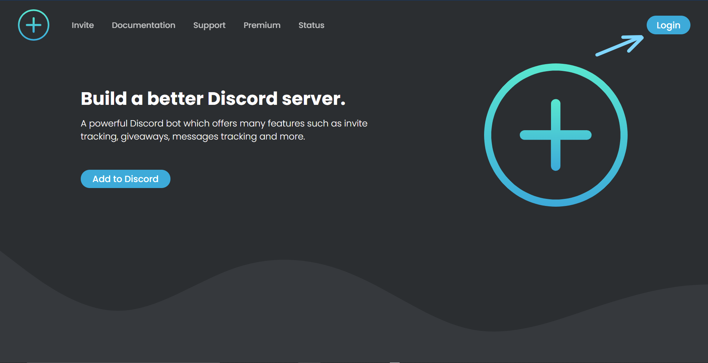
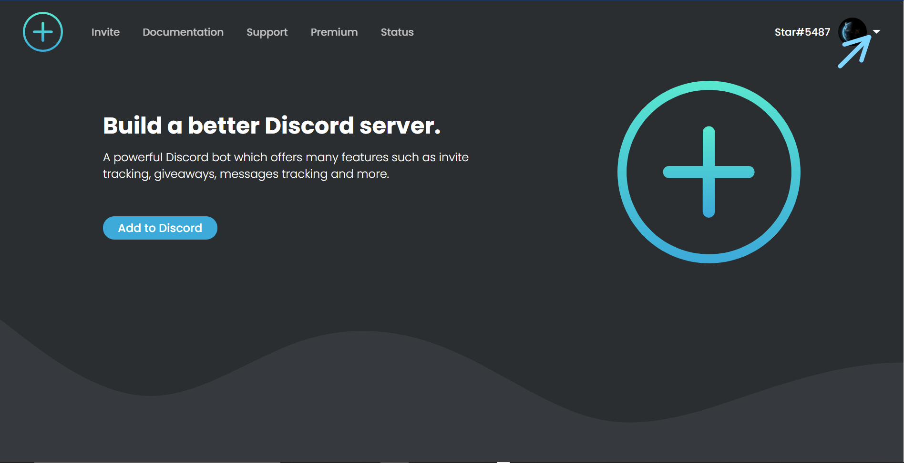
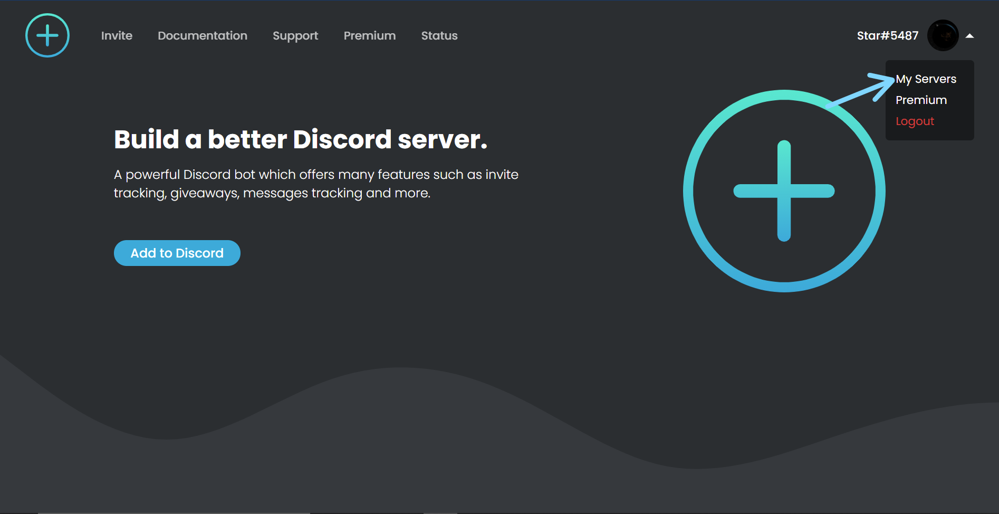

# Dashboard

If you are looking to use Invite Tracker's dashboard instead of commands, then you have come to the right place. Here we will be teaching you how to **log in**, **view your server list** and **edit your server's settings** alongside briefly explaining every feature in a very understandable way with an excessive amount of pictures so you do not get lost.

## Finding The Website

Found it! It is [here](https://invite-tracker.com/).

## Accessing The Dashboard

### Logging In

To log into the dashboard, just simply click **Login** in the top right corner.

After clicking **Login**, you just want to log in with your normal Discord account. Do not worry about safety as we actually do not collect any of your login information since you are logging in through Discord's website and not ours.

### Viewing Your Server List

After logging in, you want to click your profile picture which is located in the exact same area as the **Login** button was.

A drop-down menu will appear. From here click **My Servers**.

When you have done this, you should see a list with all the servers you have permission to add the bot to.

### Accessing Your Server's Dashboard

Now click **Dashboard** on the server you want to edit the dashboard for. For our example, we will be using Invite Tracker Support.

When you have followed the step above, you will be greeted by the screen below. 

These are all the plugins for your server. A plugin is a feature available through the dashboard. Let us go through all the different plugins, what they do and how to use them.

## Administration

As of now, there are only two different administration settings available on the dashboard: the bot's prefix and language. These features are very simple so we will not be spending a lot of time on them. More information on the prefix and languages is located in [Server Settings](../commands/administration.md#server-settings).

## Join, Join DM and Leave Messages

Join, leave and join DM messages are all very similar plugins that are set up and do almost the exact same thing. The only differences being the reasons for the different messages to trigger and the different variables you can use to configure them.  
For our examples, we will be using join messages.

### Configuring a Channel

After clicking the message category you want to configure, you will see a screen looking like the one below.

The first thing you would want to do is select the channel you want your message to be sent in. As you can see, we have configured our message to be sent to a channel called "test-welcome". You configure a channel by clicking the bar under the **Channel** section. This does not apply to join DM messages.

### Choosing a Sub-Message Type

After choosing a channel continue down to the **Messages** section of the page. You should see two black boxes as shown above. The first one is set to **Normal** by default, but you may change this if you are looking to edit another message type. A list of all the different types and their explanation can be found [here](../commands/configuration/types.md#sub-message-types).

### Configuring a Message

When you have chosen the message type you want to configure, then you may pay attention to the large black text box. This is where you write down the message you want Invite Tracker to display when someone joins the server. The message may be anything you like.

#### Using Variables

Usually, you want the message to display information that changes depending on who just joined or who invited the person that just joined, for example. The way to add this type of varying information is by adding variables. You can find the complete list of all variables [here](../commands/configuration/variables.md).

#### Using Emojis

Lastly, you may use emojis for your message too. Adding emojis is simple. Just click the little smiley face in the top right corner of the black text box and select the emoji you are looking to add.

Take to mind that the only emojis that appear on the emoji keyboard are the ones from the server you are configuring the join message for. If you are looking to use emojis from other servers, please send the following ****message in any Discord server: `\:emoji name:`, it will replace the message with something that looks like this: `<:invitetracker:744565894289555456>`. If you take that message and put it into the dashboard, Invite Tracker will display the emoji when sending a message.


**There are two main problems with using custom emojis from other servers:**

1. You can not use emojis from servers that Invite Tracker are not in.

2. There is a chance that the server removes either Invite Tracker or the emoji.


### Creating the Message

If we take all the information we just learned, we can make our very own custom join message. Let us make our join message look something like this:

Now if we do `-testmessage join normal`, we get this message:

Note that doing the exact same message we did will not work for you since some of the emojis are from Invite Tracker Support. A simple template you can use is something as simple as: `%member_mention% has been invited by %inviter% who now has %inviter_invites% invites.`


Remember to turn on join messages after finishing configuring your message by clicking the upper-most switch.


###  Embed

Embeds are a cool way to make join messages. Embeds bring a lot more customisation to the table. You can configure anything from a 5-part story about a potato falling in love with a green rock. Or you could configure the message to display all the variables, their function and where to use them, trust me, I have done it.

To enable and start configuring an embed, please click the switch right above the textbox at the right side of your screen labelled **Embed**.

After it has been enabled, you are prompted with a lot of text boxes. It might look like a lot, maybe even too much, but do not worry as everything will be explained. 

An overview of where everything is placed in the embed can be found below.

Now that you have a general idea of how the embed looks and what goes where we can get to the usage of every textbox.

#### Author

**Author Icon URL** is where you can put either a picture link or an avatar variable. It will display the image as a small profile picture in the top left corner of the embed.

**Author Name** is just a regular textbox where you can add whatever you want. Take to mind that bold, italic, strikethrough or code fields do not work here.

**Author Name URL** is where you can put either a picture link or an avatar variable. It will create a hyperlink on the author name content.

#### Title

**Title** is just a regular textbox where you can add whatever you want.

**Title URL** is where you can put either a picture link or an avatar variable. It will create a hyperlink on the title content.

#### **Content**

**Description** is just a regular textbox where you can add whatever you want.

**Add Field** adds more title and description textboxes.

#### Pictures

**Image URL** is where you can put either a picture link or an avatar variable. It will display the image as a large picture at the bottom of the embed.

**Thumbnail URL** is where you can put either a picture link or an avatar variable. It will display the image as a medium-sized picture at the top right of the embed.

#### Footer

**Footer Text** is just a regular textbox where you can add whatever you want. Take to mind that bold, italic, strikethrough or code fields do not work here.

**Footer Icon URL** is where you can put either a picture link or an avatar variable. It will display the image as a small profile picture in the top left corner of the embed.

#### Extra

**Display Current Message Date** will show at what time the message was sent.

**Color Picker** will change the colour of the embed line. Default is grey.

Taking everything we now know about embeds, I will make a simple embed message that looks like this:

Now if we do `-testmessage join normal`, we get this message:


There is really no right or wrong way to use all the embed boxes, just play around with it until you find something you like.



Pay attention to the small numbers under a few of the textboxes and buttons. They are the limits on how much can be fitted into that specific area.



You can not use embeds for join DM messages.


## Giveaways

The giveaway plugin lets you create and administrate giveaways in a very intuitive way which gives you a full overview of everything. Let us take a look at how it works.

### Creating a Giveaway

When first clicking the giveaway plugin, you will see a pretty empty screen with only one button.

To start creating a giveaway, simply click the big blue button. This will make another menu pop up. 

At first glance, it might look like a lot of very complicated stuff, but do not worry. We will go through everything.


Some of these features are premium features and will not appear on your giveaway creation menu, so do not worry if you do not see everything shown.


#### Prize Name and Winner Amount

**Prize Name** is nothing more than what you want to call your giveaway. We recommend you include the prize of the giveaway in the name.

**Winner Amount** is where you insert how many winners you want for your giveaway. Invite Tracker will select out the specified amount of winners when the giveaway ends.

For our giveaway, I will name it "Invite Tracker Premium" and set it to choose 2 winners.

#### End Date

The first box under **End Date** is where you configure what day you want the giveaway to end. The format, as shown in the box, is dd/mm/yyyy. You can also click the little calendar icon on the right side of the box to display an interactive calendar which you can use to choose the day you want the giveaway to end.

The second box is where you configure at what time you want the giveaway to end. It uses a 24-hour clock format. You can also click the little clock icon on the right side of the box to display an interactive time selector which you can use to choose the time you want the giveaway to end.

For our giveaway, I will set it to end in 5 days from when this is being written at 4 o'clock.


The giveaway ends at the configured time in your time zone.


#### Channel

The only box under **Channel** is where you configure which channel you want the giveaway to be sent in. Simply click the box and choose the channel.

For our giveaway, I will assign it to be sent in a channel called "\#test".

#### Required, Bonus Entry and Winner Roles

**Required Roles** will be required when joining a giveaway. If you do not have **all** the required roles and you try to join the giveaway, your reaction will automatically be removed.

**Bonus Entry Roles** are all awarded a specified amount of bonus entries to the giveaway. Users with these roles have an increased chance of winning the giveaway.

\*\*\*\* **Winner Roles** are roles that are given to the winner\(s\) of the giveaway.

After choosing a role, click the blue button to the right saying **Add role**. All assigned roles will appear in the box below the one you assign them in. Remember to add the number of bonus entries given to each role when assigning bonus entry roles.

To join our giveaway, I will require a role called "Invite Tracker User". I will give bonus entries to people with the roles called "Invite Tracker Lover" and "Cool Person", and I will reward the winners with a role called "Giveaway Winner".

Ignore the unassigned roles which stay in the box. They are not added, that is just how it is displayed.

#### Required Messages

**Required Messages** is pretty self-explanatory. In order to join the giveaway, you have to have the required number of messages sent in the server.

To join our giveaway, I will require each member to have sent at least a total of 50 messages in the server before being able to join.

####  DM Winners

When this switch is active, it will send a direct message to the winner\(s\) of the giveaway.

For our giveaway, I will activate this feature.

#### Finishing the Giveaway Creation Process

Now we should have a fully configured giveaway which should look something like this:

Now we just hit the blue button at the bottom of the page named **Create giveaway** and the giveaway should be made in the configured channel. If not, check Invite Tracker's permissions first.

Now that we have an active giveaway, we can go back to the dashboard and see that it has been added to the list of the server's active giveaways.

If you want to know how to edit giveaways, please continue reading.

###  Editing a Giveaway

To edit a giveaway, just click the blue **Edit giveaway** button. This will show almost the exact same menu as the giveaway creation menu. 

From here you can edit anything you like and after you save, Invite Tracker will make the necessary changes to the giveaway in the server.

For our giveaway, I want to change the required messages up to 100 instead of 50.

Now you can just go ahead and click **Edit giveaway**. Now if you check your server, you will be able to see that the giveaway has changed.

Do not worry if people who do not meet the new requirements reacted before you edited the giveaway as the bot checks each user to see if they meet the requirements when choosing a winner.

## Reward Roles

When clicking this plugin, you will be prompted with this menu:

This is where you configure all the reward roles in your server on the dashboard. A reward role is granted when a user reaches a certain amount of messages. Every feature and its explanation is written underneath.

#### Blacklisted Channels

Any message sent to a channel assigned here will not be counted towards a user's total number of messages sent. To add a channel, just simply choose it in the list and click the blue **Add channel** button.

For our server, I will assign this to "\#bot-channel" as I do not want people to gain messages for using lots of commands.

#### Reward Roles

This is where you assign the actual reward role. To assign a role as a reward role, just simply choose it in the list, choose the number of messages a user needs to gain this role, and then click the blue **Add role** button.

For our server, I will make a role called "Junior Member" be awarded at 500 messages, a role called "Senior Member" awarded at 1500 messages, a role called "Elite Member" awarded at 3000 messages and a role called "Superior Member" awarded at 5000 messages.

#### Enabled

Now that we have configured everything, we click the switch under **Enabled** so that it is on.

We should now have something that looks like this:

## 


Remember to save frequently so you do not lose meaningful work!


